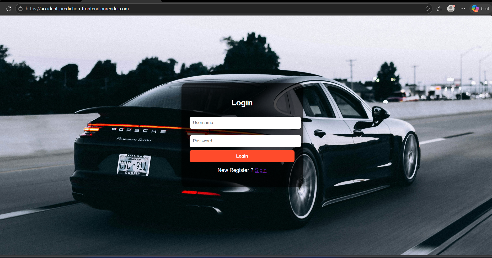
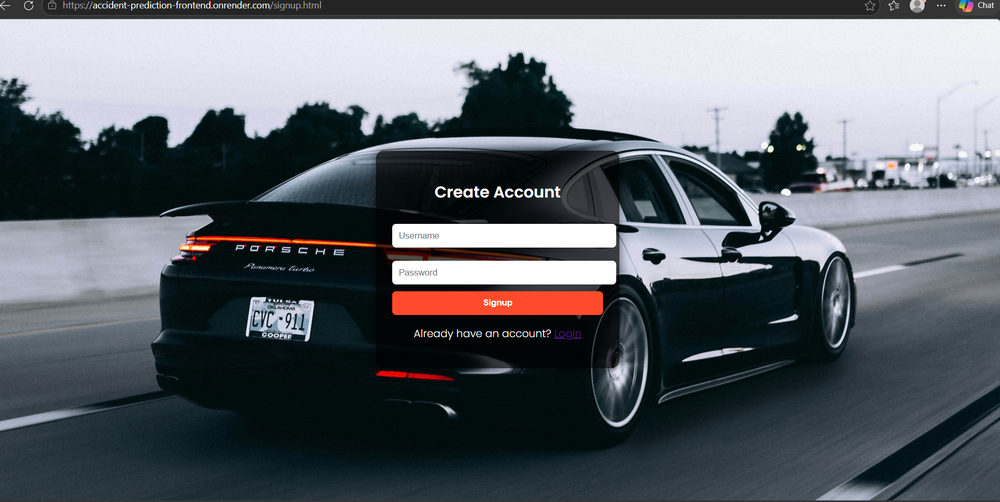
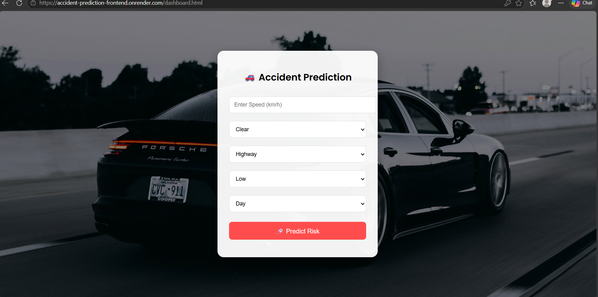
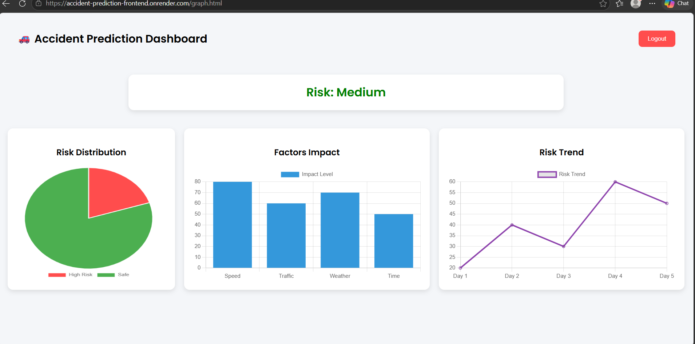

🚧 Road_Accident_Prediction_System

A full-stack web application developed using Spring Boot to manage and analyze road accident predictions data. The system allows users to store, retrieve, and explore accident-related information through REST APIs and a simple frontend interface.

 📌 Project Overview

The Road Accident System is designed to handle accident data efficiently by storing details such as weather conditions, road type, and traffic information.

It helps in understanding accident patterns and provides a structured way to manage accident records using a backend built with Spring Boot.

 🛠️ Tech Stack

### Backend

* Java
* Spring Boot
* Spring Data JPA
* Hibernate
* *Spring Security

### Frontend

* HTML
* CSS
* JavaScript

### Database

* PostgresSql

🌐 Live Demo

🚀 Frontend:https://accident-prediction-frontend.onrender.com

⚙️ Backend API:https://accident-prediction-backend.onrender.com

## ⚙️ Features

* Add and store accident records
* Retrieve accident data using REST APIs
* View details based on different conditions
* Backend integration with PostgresSQL database
* Simple and responsive user interface

## 📂 Project Structure

backend/
├── controller/
├── service/
├── repository/
├── entity/
└── application.properties

frontend/
├── index.html
├── style.css
└── script.js

---------## ⚙️ How to Run---------------

### 1. Clone the repository

git clone https://github.com/123chenna/Road_Accident_Prediction_System

* Backend: https://github.com/123chenna/accident-prediction-backend

  
* Frontend: https://github.com/123chenna/accident-prediction-frontend

### 2. Configure PostgresSQL

Update `application.properties`:

spring.datasource.url=jdbc:postgressql://localhost:3306/accident_db

spring.datasource.username=root

spring.datasource.password=your_password

spring.jpa.hibernate.ddl-auto=update

### 3. Run the backend

Run the main Spring Boot application

### 4. Open frontend

Open `index.html` in browser or use Live Server

## 🔗 API Endpoints

* GET /accidents → Fetch all records
* GET /accidents/{id} → Fetch record by ID
* POST /accidents → Add new accident

## 🔗 Related Repositories

* Backend: https://github.com/123chenna/accident-prediction-backend-
* Frontend: https://github.com/123chenna/accident-prediction-frontend

## 📸 Screenshots
## 📸 Screenshots  

  
 
  
  
  
  
  
  

## 🚀 Future Improvements

* Add authentication (login system)
* Improve UI design
* Deploy application to cloud
* Add advanced analytics dashboard

## 👨‍💻 Author

**Majjari Chenna Keshava**

https://github.com/123chenna

keshavachenna330@gmail.com

8639588635

## ⭐ Support

If you found this project useful, consider giving it a ⭐ on GitHub!
